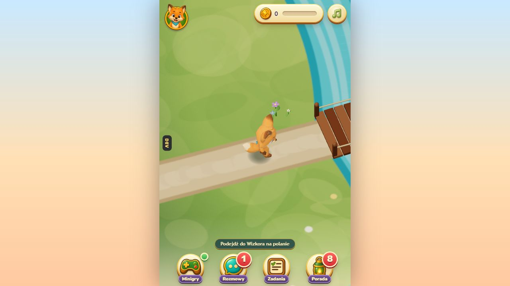
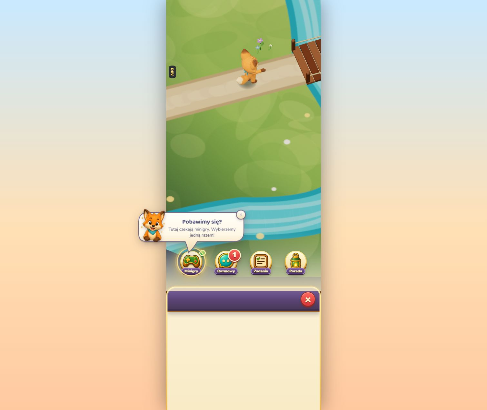
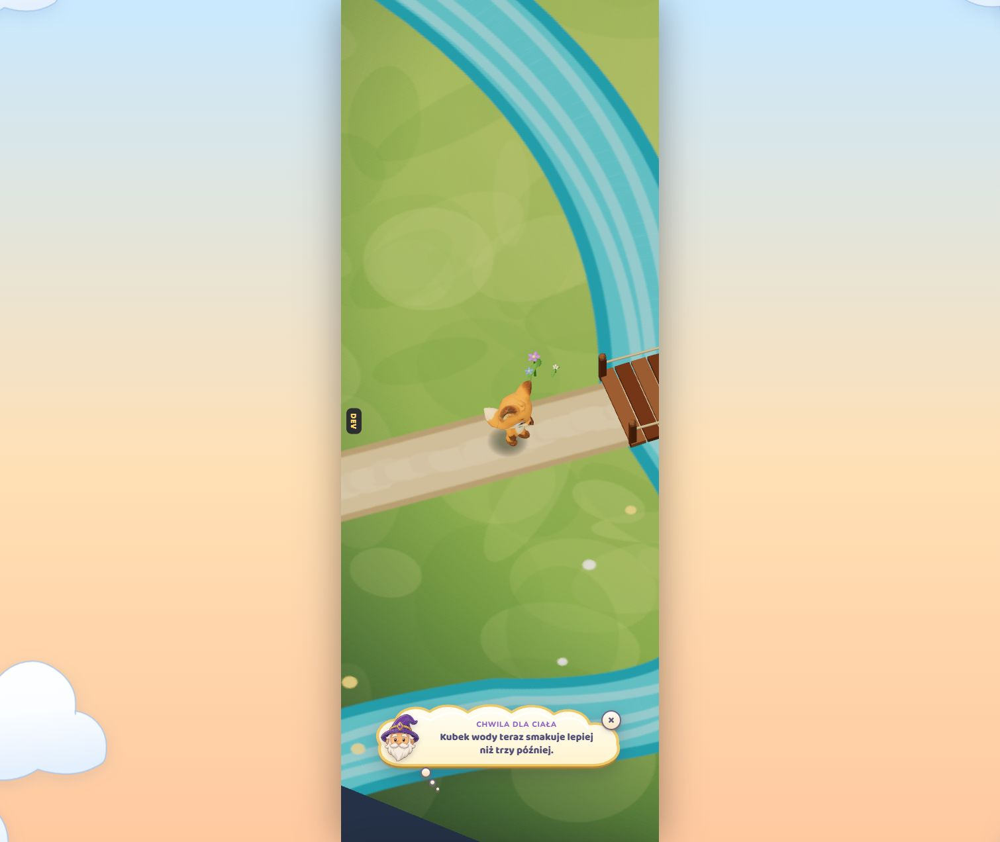
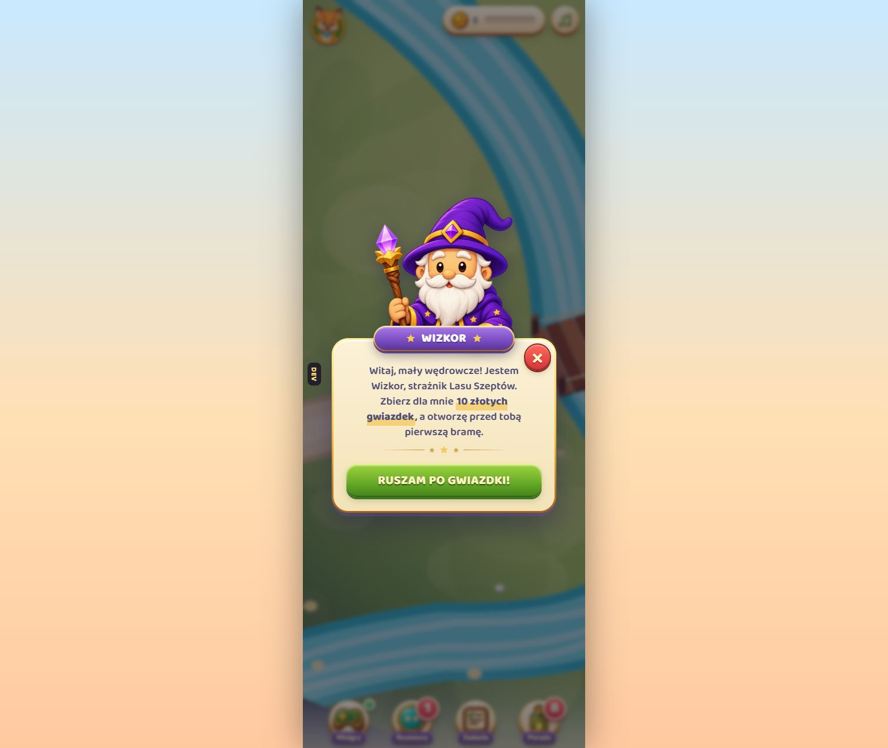
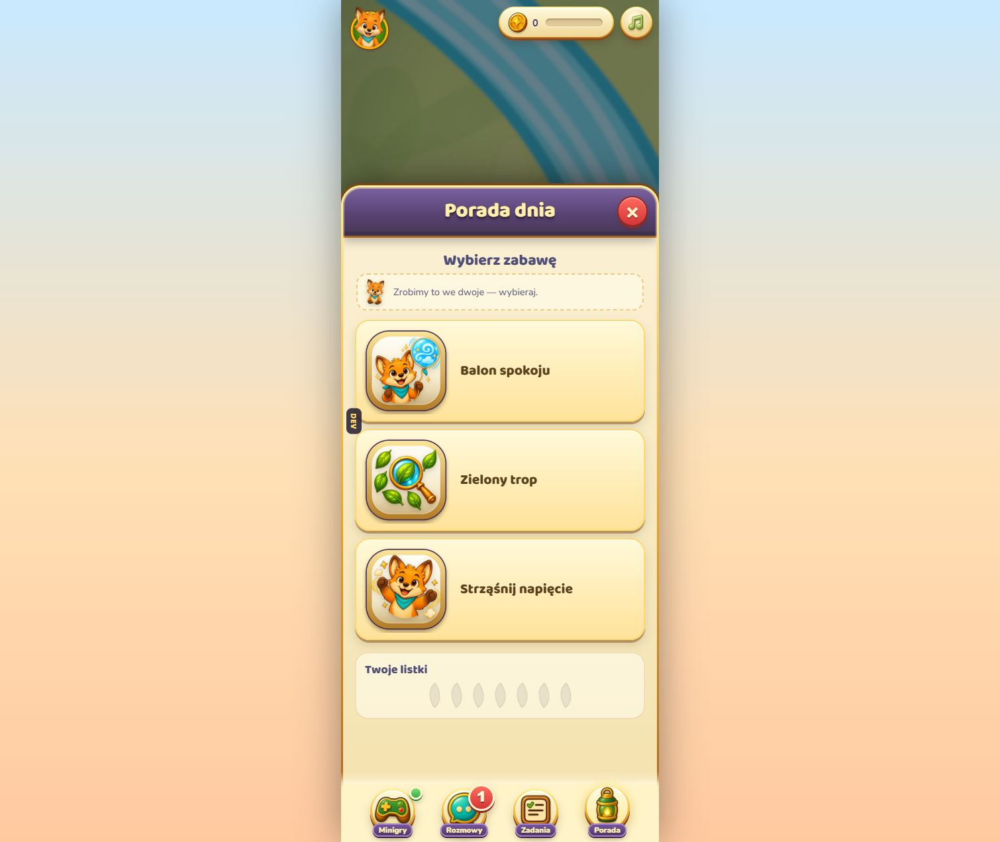
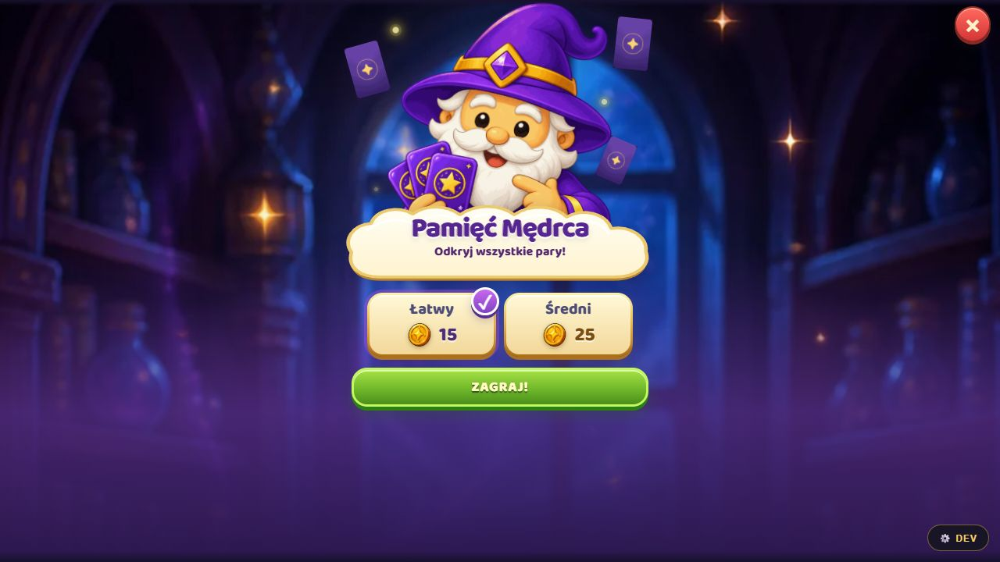
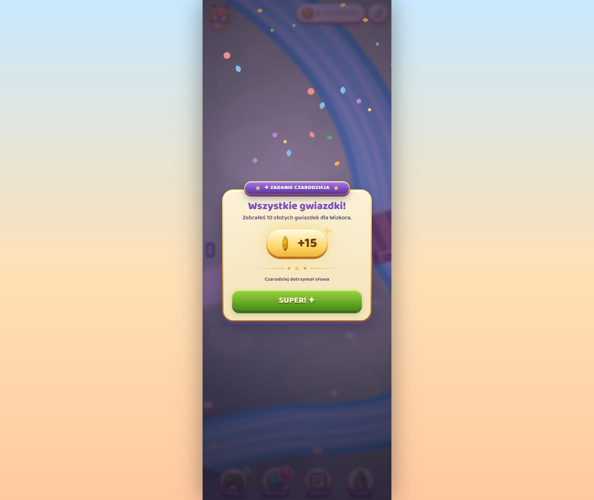

# EwolucJA UI — system interfejsu gry

Ten dokument opisuje **aktywną warstwę UI widoczną w aplikacji**: HUD, okna, popupy, dymki, panele, komunikaty i ekrany nagród. Nie opisuje grafiki świata ani renderowania 3D. Jest punktem odniesienia do dalszej implementacji, a nie katalogiem wszystkich historycznych stylów w repozytorium.

## 1. Co jest źródłem prawdy

System należy rozwijać na bazie tych plików:

| Obszar | Komponent / styl |
|---|---|
| tokeny, typografia, CTA, podstawowe karty | `frontend/src/styles/ewolucja.css` |
| układ huba, popup postaci, panel dolny, dymek prowadzący | `frontend/src/hub/styles/hub.css` |
| HUD, dok i zwój wiadomości | `frontend/public/scena-3d/hud.css` |
| ekran nagrody | `frontend/src/styles/nagroda.css` |
| popup postaci | `frontend/src/hub/PopupPostaci.jsx` |
| panel wysuwany | `frontend/src/hub/PanelSheet.jsx` |
| zwój wiadomości | `frontend/src/hub/MessageScroll.jsx` |
| wskazówka celująca w UI | `frontend/src/hub/Reflektor.jsx` |
| powiadomienie Mentora | `frontend/src/components/HintPopup.jsx` |
| nagroda | `frontend/src/components/RewardScreen.jsx` |
| ekran wejścia do minigry | `frontend/src/hub/EkranStartuGry.jsx` |

Nowe elementy powinny składać się z tych wzorców i tokenów. Nie należy kopiować ich wyglądu do kolejnych lokalnych bloków `style={{...}}`.

## 2. Charakter wizualny

UI ma wyglądać jak interaktywna, baśniowa zabawka dla dziecka w wieku 7–9 lat:

- jasny pergamin zamiast czystej bieli;
- złota rama oznacza obiekt, który można otworzyć lub zdobyć;
- fiolet oznacza magię, Mentora i postacie prowadzące;
- zieleń oznacza bezpieczną główną akcję „idź dalej”;
- czerwone koło zawsze oznacza zamknięcie lub powrót;
- ilustracja postaci jest częścią bryły okna i może wychodzić poza kartę;
- jedna duża decyzja na ekranie, bez konkurujących CTA;
- tekst nigdy nie jest jedynym nośnikiem stanu, a głos nigdy nie blokuje działania.

## 3. Tokeny

Wartości są migawką aktualnego systemu. W kodzie należy używać zmiennych z `ewolucja.css`, nie wpisywać wartości ponownie.

### Kolor

| Token | Wartość | Znaczenie |
|---|---:|---|
| `--p-paper` | `#FBF1D6` | powierzchnia kart i okien |
| `--p-paper-2` | `#F4E3B8` | dolna część pergaminowego gradientu |
| `--p-ink` | `#4E4D76` | podstawowy tekst |
| `--p-ink-soft` | `#5A4F77` | opis i tekst drugorzędny |
| `--p-magic` | `#B886E8` | magia i Mentor |
| `--p-magic-dk` | `#7A4DC2` | mocny fiolet, aktywny stan |
| `--p-amber` | `#F4C95D` | złoto, nagroda i wyróżnienie |
| `--p-dusk` | `#E89A3D` | ciemniejszy bursztyn |
| `--p-leaf` | `#5FA76F` | akcja pozytywna |
| `--p-leaf-dk` | `#2F5841` | cień i obrys zieleni |
| `--p-rose` | `#F08C8C` | ostrzeżenie, nigdy główne CTA |

### Typografia, promienie i cień

- Nagłówki i kontrolki: `Baloo 2`, waga 700–800.
- Tekst: `Nunito`, waga 600–800.
- Pismo postaci w podpisie dymku: `Caveat`, tylko jako akcent.
- Karta: `--r-card: 22px`; modal postaci może użyć `28px`.
- Pigułka i wstęga: `--r-pill: 999px`.
- Cienie: `--shadow-sm`, `--shadow-md`, `--shadow-lg`.
- HUD zachowuje jeszcze kompatybilne fallbacki `Arial Rounded` / `Trebuchet`; nie są one wzorcem dla nowych ekranów.

### Skala interakcji

| Element | Standard | Mały ekran (`≤360px` lub wysokość `≤600px`) |
|---|---:|---:|
| główne CTA | 56 px / 21 px | 50 px / 18 px |
| akcja drugorzędna | 48 px / 16 px | 44 px / 15 px |
| zamknięcie panelu lub gry | 46 × 46 px | bez zmniejszania poniżej 44 px |
| odstęp treści karty | 16–22 px | 12–16 px |
| boczny margines pełnoekranowego UI | 16 px | 8–12 px |

## 4. Kanoniczne komponenty

### Biblioteka Figma

Plik roboczy: [EwolucJA UI Kit — Game UI Components](https://www.figma.com/design/qE7JhXghNiFleaYlIRvf0j/EwolucJA-UI-Kit?node-id=10-2&p=f). Strona `03 Game UI Components` zawiera komponenty wyciągnięte z aktywnej aplikacji, a nie ogólny webowy UI kit:

| Komponent w Figma | Stany / zawartość | Źródło w aplikacji |
|---|---|---|
| `Icon Button / Close` | zamknięcie, czerwony soft-clay | `.hub-sheet-close`, `.popup-postaci-zamknij` |
| `Icon Button / Audio / Muted` | dźwięk wyłączony | `.game-hud-music` |
| `Badge / Notification States` | licznik `1`, licznik `7`, zielona kropka | `.game-hud-badge` |
| `HUD / Resource Counter` | energia, monety, postęp, audio | `.game-hud-counter*` |
| `Dock Item / Rozmowy` | złoty krąg, ikona, podpis | `.game-hud-dock`, `.game-hud-label` |
| `Trait Card / Progress` | nazwa, pasek, poziom | `.profil-cecha`, `.profil-pasek` |
| `Notice / Safety and Mentor` | prywatność, polecenie, instrukcja aktywności | `CzatPanel`, `glosLiska`, `poradaDnia` |
| `Button / Game CTA` | `Zrób to ze mną`, `Zagraj!` | `.start-gry-cta`, skala `--cta-*` |
| `Reward Tile / States` | locked, available | kafle poziomów i nagród |
| `Choice Tile / Conversation` | Forum, Prywatne, nowa wiadomość | `.czat-kafelek*` |
| `Modal / Rozmowy` | nagłówek, zamknięcie, dwie decyzje | `PanelSheet`, `CzatPanel` |
| `Bubble / Speech and Thought` | wypowiedź z ogonkiem, myśl z okrągłym śladem | `Reflektor`, komunikat Mentora |
| `Panel Header / Purple` | fioletowo-złota belka + zamknięcie | `.hub-sheet-head` |
| `Progress / Trait and Coins` | zielony postęp cechy, złoty postęp monet | `.profil-pasek`, `.game-hud-progress` |

Wszystkie te elementy są komponentami na płótnie Figmy. Fonty pozostają tekstem, a kształty są edytowalnymi wektorami. Warianty stanów pokazane obok siebie należy przy dalszej publikacji biblioteki rozbić na właściwości komponentu (`State`, `Type`, `Size`) i powiązać z istniejącymi zmiennymi `01 Primitives`, `02 Semantic Colors` oraz `03 Dimensions`.

### A. HUD i dok — stała orientacja

HUD pokazuje zasoby i cztery główne miejsca. Jest stale obecny podczas swobodnego chodzenia, ale znika pod pełnoekranową minigrą. Plakietka oznacza liczbę rzeczy oczekujących na działanie, nie liczbę wszystkich wiadomości.



### B. Reflektor — lekka wskazówka kontekstowa

`Reflektor` wskazuje **jeden istniejący element**, mierząc jego prawdziwą pozycję. Dymek ma zintegrowany ogonek, postać, krótki tytuł i najwyżej dwa zdania. Nie pokazuje podpisu postaci ani osobnej kontrolki audio — ilustracja wystarcza do rozpoznania mówiącego, a głos pozostaje opcjonalnym automatycznym dodatkiem.

- `tryb="dymek"`: świat pozostaje aktywny, dymek znika sam;
- `tryb="reflektor"`: tylko dla kroku koniecznego do dalszej gry; świat jest przyciemniony;
- dotknięcie dymku zamyka go, ale nie wykonuje działania za dziecko;
- nie dodajemy do dymku zielonego CTA — dziecko ma dotknąć wskazanej ikony;
- jednocześnie może być widoczna tylko jedna wskazówka.



W systemie są dwa komiksowe warianty tej samej rodziny:

- **wypowiedź** — gładka kremowa bańka z ostrym ogonkiem, używana gdy postać mówi albo wskazuje konkretny element;
- **myśl** — obła chmura ze śladem trzech coraz mniejszych kółek, używana dla spokojnej refleksji lub porady „Chwila dla ciała”.

Oba warianty mają cienki przygaszony obrys, miękki efekt clay 3D, wyśrodkowaną treść i równe pionowe paddingi. Nie pokazują nazwy postaci ani ikonki nutki.



### C. Popup postaci — dialog blokujący

`PopupPostaci` służy do pierwszego spotkania, ważnego zaproszenia albo decyzji postaci. Zatrzymuje świat, przyciemnia tło i ma jedną dominującą akcję.

Anatomia: postać wychodząca z karty → wstęga z imieniem → krótka wypowiedź → złoty przerywnik → główne CTA → opcjonalne „nie teraz”. Krzyżyk jest zawsze w tym samym prawym górnym miejscu.



### D. Panel dolny — treść do przeglądania

`PanelSheet` jest dla gier, porad, zadań, rozmów i innych sekcji huba. Ma wspólną wysokość, pergaminowe ciało, fioletowo-złoty nagłówek oraz jedno miejsce zamknięcia/powrotu. Tło pozostaje widoczne jako kontekst, ale panel przejmuje fokus.



### E. Zwój wiadomości — trwała skrzynka

`MessageScroll` przechowuje informacje, do których dziecko może wrócić. Powiadomienie nie powinno wyskakiwać, jeśli wystarczy zapisać je w zwoju i zapalić plakietkę. Zadanie w toku jest przypięte; jego stan znika dopiero po wykonaniu, nie po samym odczycie.

### F. Ekran startu minigry

`EkranStartuGry` jest pełnym, ilustrowanym progiem przed rozgrywką. Pokazuje nazwę, zasady w jednym zdaniu, wybór poziomu i jedno zielone CTA. Nie stosujemy tu technicznego loadera ani pustej karty.



### G. Nagroda — finał działania

`RewardScreen` jest najwyższą warstwą. Pokazuje najpierw wynik obrazkowy i liczbę monet, dopiero potem statystyki. Ma jedno zamknięcie prowadzące dalej. Konfetti i lot monet są dekoracją; stan musi pozostać czytelny przy `prefers-reduced-motion`.



### H. Zasłona ładowania

Chmurowa kurtyna zasłania pierwsze wejście do świata do chwili gotowości sceny. Jest przejściem narracyjnym, a nie popupem i nie może odsłonić pustego WebGL ani surowego komunikatu technicznego.


## 5. Poziomy komunikatów i moment użycia

| Poziom | Forma | Kiedy | Czy blokuje |
|---|---|---|---|
| 0 — stan | plakietka, krótki toast | skutek wykonanej czynności, nowa rzecz do sprawdzenia | nie |
| 1 — prowadzenie | dymek `Reflektor` | po chwili spokoju, przy jednym konkretnym celu | nie |
| 2 — zaproszenie | popup postaci | postać inicjuje spotkanie lub wybór | tak, na czas decyzji |
| 3 — konieczny krok | `Reflektor` w trybie mocnym albo modal | bez tego nie można poprawnie kontynuować | tak |
| 4 — finał | `RewardScreen` | po zakończeniu gry lub odebraniu nagrody | tak |

Kolejność treści wydarzenia:

1. **Przed wydarzeniem** — krótka zapowiedź i wskazanie miejsca.
2. **W trakcie** — najwyżej jedna instrukcja dotycząca bieżącej czynności.
3. **Po wydarzeniu** — potwierdzenie, nagroda albo wpis w skrzynce; bez ponownego tłumaczenia kroku, który już wykonano.

Aktualny rytm lekkich podpowiedzi:

- „Porada dnia”: pierwszy raz po 75 s spokojnego huba, 9 s na ekranie, kolejna próba po 210 s, maksymalnie 3 razy w sesji;
- „Minigry Liska”: pierwszy raz po 90 s, 10 s na ekranie, kolejna próba po 240 s, maksymalnie 3 razy w sesji;
- podpowiedź przestaje wracać na zawsze po rzeczywistym wejściu do wskazanego miejsca;
- licznik nie biegnie podczas modala, panelu, minigry, nagrody ani pierwszego celu ruchowego.

## 6. Warstwy nad WebGL

WebGL renderuje świat. React/CSS renderuje cały interfejs i pozostaje niezależny od rozdzielczości canvasu.

| Warstwa | Zastosowanie | Poziom |
|---|---|---:|
| scena WebGL | obraz świata; `aria-hidden` | 0 |
| panel dolny wewnątrz huba | treść sekcji | 5 |
| HUD i dok | stałe sterowanie świata | 20 |
| zwój / lekka karta Mentora | wiadomości i nieblokująca informacja | 40 |
| dymek prowadzący | wskazanie elementu HUD | 58 |
| popup postaci | ważna rozmowa lub decyzja | 60 |
| pełnoekranowa minigra | osobny tryb działania | 70 |
| modal specjalny | wyjątkowa czynność pełnoekranowa | 92 |
| ekran nagrody | finał ponad wszystkimi trybami | 9999 |

Zasada implementacyjna: canvas nigdy nie powinien rysować tekstów, CTA ani okien systemu. Jeśli UI musi wskazać obiekt w WebGL, scena publikuje prostokąt/koordynaty, a warstwa DOM pozycjonuje nad nim istniejący komponent.

## 7. Mobile i responsywność

- Na szerokości `≥520px` hub ma szerokość 480 px i jest wycentrowany; poniżej wypełnia viewport.
- Należy używać `100dvh` oraz `env(safe-area-inset-*)` przy elementach przyklejonych do krawędzi.
- Dymek ma maksymalnie około 326–348 px i zawsze co najmniej 8–12 px marginesu od ekranu.
- Treść panelu przewija się wewnątrz niego; dok i przyciski zamknięcia nie mogą odjeżdżać z treścią.
- Długie etykiety CTA skalują rozmiar tekstu, ale nie zmieniają znaczenia ani głównej wysokości kontrolki.
- Przy szerokości `≤360px` działania ustawione obok siebie należy składać pionowo, główne CTA jako pierwsze.
- Elementy wystające z kart trzeba skalować razem z kartą przez `clamp()`, nie pozycjonować stałą liczbą pikseli dla jednego telefonu.
- Animacje muszą mieć wariant `prefers-reduced-motion`; żadna instrukcja nie może zależeć od ruchu lub dźwięku.

## 8. Gotowe wzorce użycia

```jsx
<PopupPostaci
  otwarty={open}
  imie="Wizkor"
  obrazek="/wizPop.webp"
  tekst="Mam dla ciebie jedno krótkie zadanie."
  wyroznienie="jedno krótkie zadanie"
  przycisk="Zaczynamy!"
  onAkcja={start}
  onZamknij={close}
/>
```

```jsx
<PanelSheet open={panel === "zadania"} title="Zadania" onClose={closePanel}>
  <ZadaniaPanel />
</PanelSheet>
```

```jsx
<RewardScreen
  eyebrow="Brawo!"
  title="Udało się"
  coins={12}
  ctaLabel="Dalej"
  onDismiss={closeReward}
/>
```

Nowy komunikat prowadzący powinien być danymi w `frontend/src/hub/wskazowki.js`, a nie nowym popupem z własnym CSS.

## 9. Czego nie włączamy do systemu

- `DevRezyserka` i wszystkie uchwyty/debug overlaye;
- route `/play`, historyczny `App.jsx` i niezależne prototypy ekranów;
- pliki `.bak`, nieużywane warianty i style eksperymentalne;
- ciemny chrome `adventure.css` jako domyślny styl dziecięcego huba — to osobny, starszy nurt;
- emoji, placeholdery i ręcznie rysowane CSS-em ilustracje jako główne assety;
- przypadkowe lokalne kolory, wysokości CTA i promienie poza tokenami;
- wiele popupów naraz albo dymek prowadzący nad otwartym panelem/modalem;
- natywną prośbę o zgodę push pokazywaną dziecku bez wcześniejszego ekranu dla opiekuna.

## 10. Lista kontrolna nowego okna

- Czy używa papieru, złota, fioletu i zieleni zgodnie z ich znaczeniem?
- Czy ma dokładnie jedną główną akcję?
- Czy zamknięcie/powrót jest czerwonym kołem w prawym górnym rogu?
- Czy tekst da się zrozumieć bez audio i animacji?
- Czy nie konkuruje z inną wskazówką albo popupem?
- Czy działa na 320 px szerokości, niskim ekranie i z safe area?
- Czy `Escape`, fokus i role ARIA odpowiadają temu, czy element blokuje świat?
- Czy używa prawdziwego assetu postaci/ikony zamiast zastępczej grafiki?
