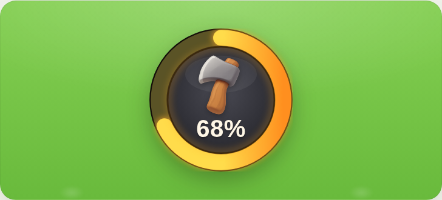

# Wskaźnik ścinania — kołowy wskaźnik postępu (HUD schronienia)

Kołowy wskaźnik, który **wypełnia się w miarę rąbania** suchego drzewka.
Należy do HUD-u schronienia (łańcuch: gwiazdki → schronienie → gry). Nie jest
licznikiem „ile zebrano" — pokazuje postęp jednej czynności, więc znika, gdy
szkielet stanie. Wzorzec jest ogólny (dowolny postęp 0–100%), a siekiera to
jego pierwsze zastosowanie.



Źródło prawdy o wyglądzie: artefakt „Wskaźnik ścinania" (żywy podgląd z suwakiem).
Ten plik jest specyfikacją do reimplementacji w grze.

---

## 1. Charakter

- **Ciemna tarcza + żywy złoty łuk.** Odwrotność pergaminowych kart huba: tu
  liczy się czytelność na zielonej trawie i sygnał „coś się dzieje". Dlatego
  złoto jest MOCNIEJSZE niż bazowy `--p-amber` (patrz tokeny niżej) i ma glow.
- **Twardy obrys całości.** Widżet ma się odcinać od świata — ciemny rant na
  zewnątrz i cienki obrys między złotem a tarczą.
- **Jedna liczba, jedno źródło.** Procent = stan czynności rąbania; nie ma
  drugiego licznika obok.

## 2. Anatomia (warstwy, od spodu)

1. **Cień** pod widżetem — CSS `drop-shadow` (nie box-shadow, bo krąg).
2. **Bezel + obrys** — ciemny dysk `--obwodka` ze `stroke: --obrys` (twardy kontur).
3. **Tor pierścienia** — pełna pętla w ciemnym złocie `--pierscien-tor`.
4. **Glow łuku** — ROZMYTA kopia łuku pod spodem, kolor `--glow`, `filter: blur`.
5. **Łuk postępu** — gradient żółć→pomarańcz, zaokrąglone końce, na wierzchu.
6. **Ciemna tarcza** — obrys od strony złota (`--obrys`) + pole z gradientem radialnym.
7. **Wewnętrzny rim-light** — cienki złoty, rozmyty obwód na krawędzi tarczy.
8. **Połysk** — delikatna elipsa u góry tarczy.
9. **Środek** — ikona siekiery + „68%".

## 3. Tokeny koloru

Wskaźnik świadomie używa ŻYWSZEGO złota niż baza UI (element HUD ma „świecić"
na trawie). Jeśli kiedyś zmienią się bazowe `--p-amber` / `--p-dusk`, wróć tu
i przelicz odcienie.

| Rola (lokalny token) | Wartość | Relacja do bazy |
|---|---:|---|
| `--pierscien-zloto-1` (złoto ↑) | `#ffdc4b` | żywsza wersja `--p-amber` `#F4C95D` |
| `--pierscien-zloto-2` (pomarańcz ↓) | `#ff8f1f` | żywsza wersja `--p-dusk` `#E89A3D` |
| `--glow` (blask łuku) | `#ffab27` | ciepły środek między złotem a pomarańczem |
| `--pierscien-tor` (nieprzebyty łuk) | `#5a5326` | ciemne, wygaszone złoto |
| `--tarcza-1` / `--tarcza-2` (pole) | `#4a4a53` → `#26262c` | grafit, gradient radialny |
| `--obwodka` (bezel) | `#211d16` | ciemny rant zewnętrzny |
| `--obrys` (twardy kontur) | `#140f09` | obrys całości i tarczy |
| `--liczba` | `#fff7e6` | kremowa biel (nie czysta #fff) |

## 4. Geometria (SVG `viewBox="0 0 100 100"`)

| Parametr | Wartość |
|---|---|
| Start łuku | 12:00 (`transform="rotate(-90 50 50)"`) |
| Kierunek | zgodny z zegarem |
| Grubość pierścienia | `11` |
| Zakończenia łuku | zaokrąglone (`stroke-linecap="round"`) |
| Promień łuku/toru | `r=43.5` |
| Bezel | `r=49.2`, `stroke-width=1.5` |
| Tarcza: obrys / pole | `r=37.7` (`--obrys`) / `r=36.7` (gradient) |
| Postęp | `stroke-dasharray = 2πr`, `stroke-dashoffset = C·(1−p)` |

## 5. Glow — jak uzyskać żywe złoto

Sekret „żywości" to **rozmyta kopia łuku pod ostrym łukiem**:

```html
<filter id="poswiata" x="-45%" y="-45%" width="190%" height="190%">
  <feGaussianBlur stdDeviation="2.4"/>
</filter>

<!-- glow: kopia w --glow, rozmyta -->
<circle class="postep" id="postepGlow" r="43.5" fill="none"
        stroke="var(--glow)" stroke-width="11" stroke-linecap="round"
        transform="rotate(-90 50 50)" filter="url(#poswiata)"/>
<!-- łuk ostry, gradient, na wierzchu -->
<circle class="postep" id="postep" r="43.5" fill="none"
        stroke="url(#zloto)" stroke-width="11" stroke-linecap="round"
        transform="rotate(-90 50 50)"/>
```

Do tego złoty rim-light na krawędzi tarczy: `r=36.7`, `stroke=var(--glow)`,
`opacity=0.32`, ten sam `filter`. **Łuk i glow steruje JEDEN postęp** —
w JS `document.querySelectorAll('.postep')` i ten sam `strokeDashoffset` na obu,
inaczej blask rozjedzie się z łukiem.

## 6. Środek (ikona + liczba)

- Grupa ikona+procent jest wyśrodkowana w kręgu; drobny `translateY` (~−5%)
  koryguje środek OPTYCZNY (przezroczysty margines ikony ciągnie ją w dół).
- **Ikona: 56%** średnicy tarczy, własny miękki `drop-shadow`.
- **Liczba:** `Fredoka` 700 (w grze → kanoniczny `Baloo 2`), rozmiar `~0.17`
  średnicy, `font-variant-numeric: tabular-nums`, `margin-top: −5%` (mały
  odstęp od ikony, z dala od dolnego łuku).

## 7. Dostępność i ruch

- `role="img"` + `aria-label="Postęp ścinania: N procent"`, aktualizowany z %.
- `@media (prefers-reduced-motion: no-preference)` — tylko wtedy przejście
  `stroke-dashoffset`. Bez ruchu wskaźnik po prostu stoi na właściwym %.

## 8. Ikona siekiery

### Styl
Miękkie 3D — gładki render ikonowy z delikatnym połyskiem (pełny opis:
[`styl-ikon-3d.md`](styl-ikon-3d.md)), NIE matowa glina świata: stalowa
głowica z jasną fazą ostrza, miodowo-brązowy trzonek, delikatny połysk, czytelna
sylwetka, światło z góry-lewej, **przezroczyste tło**. Renderowa poświata
wtapia się w ciemną tarczę — nie trzeba jej wycinać (ewentualnie alfa < 60 → 0
daje twardszą krawędź).

### Generacja — pipeline (patrz też `docs/grafika.md`)
- **Generator:** OpenAI Images `gpt-image-1` (kanoniczny generator gry).
- **Skąd:** z maszyny autora (Windows). Klucz `OPENAI_API_KEY` z `backend/.env`
  — **nie opuszcza maszyny**. UWAGA: sieć piaskownicy agenta blokuje
  `api.openai.com` (403 polityki) — generować lokalnie, nie z sandboxa.
- **Skrypt:** `scripts/gen-siekiera.mjs` → `node scripts/gen-siekiera.mjs`.
  Parametry: `size 1024x1024`, `quality high`, `background transparent`.
- **Prompt (skrót):** „single friendly hatchet axe icon for a cozy low-poly
  children's game, chunky steel head with bright beveled edge, warm honey-brown
  wooden handle, soft-3D clay look, blade facing left, transparent background,
  no text, no shadow."

### Pliki
| Plik | Rola |
|---|---|
| `frontend/public/assets/rabanie/siekiera.png` | mistrz 1024 px, przezroczyste tło |
| wersja 256 px (~27 KB) | zoptymalizowana do HUD (do wpięcia w grze) |

---

## 9. Do zrobienia przy wpięciu do gry

- Przełożyć lokalne tokeny na role w `ewolucja.css` (albo dodać `--wsk-*`),
  nie zostawiać `#ffdc4b` inline w JSX (zasada z `SYSTEM_STYLOW.md`).
- Zamienić `Fredoka` → `Baloo 2`, dosunąć rozmiary do skali z README (§3).
- Podłączyć `%` do realnego postępu rąbania (`zadanieDrewna` / scena), nie do
  licznika sztuk — ma pokazywać CZYNNOŚĆ, nie stan magazynu.
